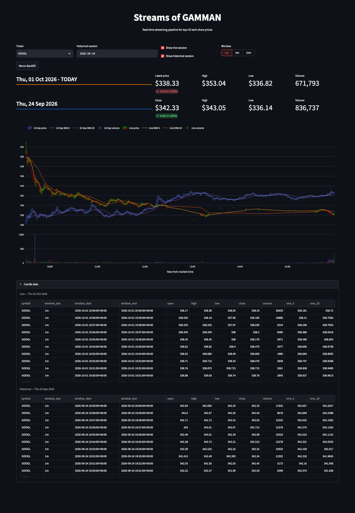

# Streams of GAMMAN

**GOOGL · AAPL · META · MSFT · AMZN · NVDA**

_A local end-to-end data pipeline for processing live and backfilled US stock-market trades._

Streams of GAMMAN consumes live trades from Alpaca, streams them through Redpanda and PyFlink, calculates OHLCV candles and moving averages, and serves the results from PostgreSQL to an interactive Streamlit dashboard.

Normal startup initializes the required local Redpanda topics, `trades.raw` and
`candles`, with one partition and one replica each. This happens before
topic-dependent services start, including when no live trades are arriving.

Historical market sessions can also be requested directly from the dashboard and reconstructed through an Airflow-orchestrated bounded Flink pipeline. When the pipeline starts after the market has opened, it can automatically catch up the current session from market open while live processing continues.

## Table of Contents

- [Architecture](#architecture)
- [Technology](#technology)
- [How It Works](#how-it-works)
- [Dashboard](#dashboard)
- [Screenshots](#screenshots)
- [Setup](#setup)
- [Make Commands](#make-commands)
- [Backfills](#backfills)
- [Catch-ups](#catch-ups)
- [Testing](#testing)
- [Design Decisions](#design-decisions)
- [Known Limitations](#known-limitations)
- [Project Status](#project-status)

## Architecture

### Live streaming

```text
Alpaca IEX WebSocket
        ↓
Python producer
        ↓
Redpanda — trades.raw
        ↓
PyFlink — event-time processing
        ↓
Redpanda — candles
        ↓
PostgreSQL sink
        ↓
PostgreSQL
        ↓
Streamlit
```

Live trades are processed continuously into **1-minute, 5-minute and 15-minute OHLCV candles**, with **SMA-5 and SMA-20** calculated from the resulting candle streams.

### Historical and catch-up backfills

```text
Streamlit
    ↓
Airflow
    ↓
Alpaca Historical API
    ↓
Redpanda — trades.raw
    ↓
Bounded PyFlink reconstruction
    ↓
Redpanda — candles
    ↓
PostgreSQL sink
    ↓
PostgreSQL
    ↓
Streamlit
```

Historical sessions can be requested from the dashboard. The same mechanism is used to catch up the current session when the pipeline starts after the market has opened.

For accurate moving averages, the bounded job also processes the preceding completed XNYS trading session as warm-up data. Those warm-up candles establish SMA state but are not emitted as part of the requested session.

Only completed candle windows are emitted during an in-progress catch-up. The continuous Flink job remains responsible for windows that are still forming.

[Back To Top](#streams-of-gamman)

## Technology

| Technology | Role |
|---|---|
| **Alpaca** | Live and historical US stock-market data |
| **Redpanda** | Kafka-compatible event streaming and durable event log |
| **PyFlink** | Event-time processing, deduplication, OHLCV aggregation and moving averages |
| **Apache Airflow** | Historical and current-session backfill orchestration |
| **PostgreSQL** | Serving layer for processed candles |
| **Streamlit / Plotly** | Interactive market dashboard |
| **Docker Compose** | Local infrastructure and service orchestration |
| **Make** | Common build, startup, testing and service-management commands |

[Back To Top](#streams-of-gamman)

## How It Works

Each Alpaca trade receives a deterministic identity based on its feed, symbol and trade ID. The identity is independent of whether the trade arrived through the live or historical path, allowing the same market event to be recognised across both sources.

The continuous Flink job processes live trades using event time and bounded-out-of-orderness watermarks. Trades are deduplicated before being aggregated into 1m, 5m and 15m OHLCV windows. SMA-5 and SMA-20 are maintained as keyed state over the resulting candle streams.

Historical trades present a different problem. By the time they are replayed, their event timestamps are far behind the continuous job's watermark, so simply inserting them into the live event-time pipeline would not reliably reconstruct historical windows.

Airflow therefore coordinates a separate **bounded Flink job** over the relevant section of the Redpanda log. The bounded job reuses the same candle-processing logic while maintaining independent event-time and moving-average state.

For a historical session, Airflow:

1. validates the requested date against the XNYS trading calendar;
2. retrieves the required historical trades from Alpaca;
3. includes the preceding completed trading session as SMA warm-up data;
4. publishes canonical trade events to Redpanda;
5. runs bounded PyFlink reconstruction;
6. emits only completed candles belonging to the requested session;
7. validates the resulting PostgreSQL candles.

The continuous and bounded paths ultimately produce the same candle schema and use the same PostgreSQL serving layer.

PostgreSQL writes use idempotent upserts, allowing historical sessions to be rerun without creating duplicate candle rows.

[Back To Top](#streams-of-gamman)

## Dashboard

The Streamlit dashboard provides:

- selectable GAMMAN ticker;
- 1m, 5m and 15m candle views;
- candlestick charts with SMA-5 and SMA-20;
- live-session metrics;
- historical-session metrics;
- historical session backfills;
- rerunning existing historical sessions;
- automatic current-session catch-up;
- live and historical overlays on a common intraday time axis.

Historical data can be displayed alongside the live session without requiring a separate serving path.

[Back To Top](#streams-of-gamman)

## Screenshots



[Back To Top](#streams-of-gamman)

## Setup

Once you have Alpaca API credentials, the complete pipeline can be started from a fresh clone in two steps:

1. run the setup block for your operating system, then paste your Alpaca credentials into the `.env` file that opens;
2. run `make start`.

### Prerequisites

Install:

- Git
- Docker Desktop with Docker Compose
- `make`
- `openssl`
- `jq`
- a graphical text editor

The setup examples below use VS Code where available. On macOS, the built-in TextEdit application can be used instead.

Docker Desktop should be allocated at least **8 GB of memory**.

You also need a free Alpaca account for market-data access.

Create an account at:

https://app.alpaca.markets/signup

A paper-trading account is sufficient. After signing in, generate an API key and secret from the Alpaca dashboard.

Keep both values available for the setup below. Alpaca only displays the secret when it is generated; if it is lost, generate a new key pair.

### Step 1 — Clone and configure

Choose the block for your operating system and paste the whole block into a terminal.

#### macOS — VS Code

```bash
git clone https://github.com/Teqfish/stock-market-streaming-pipeline.git
cd stock-market-streaming-pipeline
cp .env.example .env
sed -i '' "s/your_generated_jwt_secret/$(openssl rand -hex 32)/" .env && code .env
```

If the `code` command is not installed, use the built-in TextEdit application instead:

```bash
git clone https://github.com/Teqfish/stock-market-streaming-pipeline.git
cd stock-market-streaming-pipeline
cp .env.example .env
sed -i '' "s/your_generated_jwt_secret/$(openssl rand -hex 32)/" .env && open -e .env
```

#### Linux — VS Code

```bash
git clone https://github.com/Teqfish/stock-market-streaming-pipeline.git
cd stock-market-streaming-pipeline
cp .env.example .env
sed -i "s/your_generated_jwt_secret/$(openssl rand -hex 32)/" .env && code .env
```

If you use a different graphical text editor, replace `code .env` with the appropriate command for that editor.

#### Windows — PowerShell + VS Code

Run these commands in PowerShell:

```powershell
git clone https://github.com/Teqfish/stock-market-streaming-pipeline.git
Set-Location stock-market-streaming-pipeline
Copy-Item .env.example .env
$jwt = openssl rand -hex 32; (Get-Content .env -Raw).Replace('your_generated_jwt_secret', $jwt) | Set-Content .env; code .env
```

The setup block:

1. clones the repository;
2. enters the project directory;
3. creates your private `.env` from `.env.example`;
4. generates a random Airflow JWT signing secret;
5. writes the generated secret into `.env`;
6. opens `.env` for editing.

In the opened `.env` file, replace:

```dotenv
ALPACA_API_KEY=your_alpaca_api_key
ALPACA_SECRET_KEY=your_alpaca_secret_key
```

with your own Alpaca credentials.

The default local configuration can otherwise be left unchanged:

```dotenv
TICKERS=GOOGL,AAPL,META,MSFT,AMZN,NVDA

POSTGRES_DB=stocks
POSTGRES_USER=stocks
POSTGRES_PASSWORD=stocks
```

Save and close `.env`.

Do not commit `.env`. It contains your private Alpaca credentials and locally generated Airflow JWT secret.

You do **not** need to configure an Airflow UI username or password. Airflow generates its local password automatically during startup.

### Step 2 — Start the pipeline

```bash
make start
```

The first startup can take several minutes while Docker downloads and builds the required environments.

`make start` automatically:

1. builds the required Docker images;
2. starts the Docker Compose stack;
3. initializes the required `trades.raw` and `candles` Redpanda topics;
4. waits for the Flink JobManager;
5. submits the continuous PyFlink streaming job;
6. opens the local web interfaces;
7. prints the generated Airflow UI credentials in the terminal.

When startup completes, the terminal will show:

```text
Streams of GAMMAN is running.

Dashboard:        http://localhost:8501
Airflow:          http://localhost:8082
Flink:            http://localhost:8081
Redpanda Console: http://localhost:8080

Airflow login
Username: airflow
Password: <generated password>
```

The project is now running.

Open the Streamlit dashboard at:

```text
http://localhost:8501
```

From the dashboard you can view live market data, request a current-session catch-up, and run historical backfills.

### Local interfaces

| Service | URL |
| --- | --- |
| Streamlit dashboard | `http://localhost:8501` |
| Airflow | `http://localhost:8082` |
| Flink | `http://localhost:8081` |
| Redpanda Console | `http://localhost:8080` |

Airflow's generated password is retained across normal restarts. To display the credentials again:

```bash
make airflow-password
```

A full:

```bash
make reset
```

removes the project's Docker volumes, including the generated Airflow credentials. A new Airflow password is generated on the next startup.

[Back To Top](#streams-of-gamman)

## Make Commands

```bash
make start
```

Build the images, start the complete pipeline, submit the continuous Flink job, open the local interfaces, and display the generated Airflow credentials.

```bash
make down
```

Stop the pipeline while preserving its Docker volumes and stored data.

```bash
make reset
```

Stop the pipeline and remove its Docker volumes. This deletes local pipeline state and causes a new Airflow password to be generated on the next startup.

```bash
make ps
```

Show the current Docker Compose service state.

```bash
make flink-jobs
```

Show the jobs currently known to the Flink JobManager.

```bash
make airflow-password
```

Display the automatically generated local Airflow UI username and password.

```bash
make test
```

Run the project's automated test suite.

[Back To Top](#streams-of-gamman)

## Backfills

Historical sessions are normally requested through the Streamlit dashboard.

Choose a ticker and trading date, enable the historical-session view, then select **Run Backfill**. Existing sessions can be reconstructed again using **Rerun Backfill**.

Airflow validates dates against the XNYS exchange calendar, so weekends and exchange holidays are rejected rather than treated as empty trading sessions.

Only one bounded reconstruction is allowed to run at a time. This prevents multiple historical PyFlink jobs from competing for the resources required by the continuously running streaming job.

A bounded reconstruction normally completes in roughly a minute on the development environment, although runtime depends on the amount of trade data and the resources allocated to Docker.

[Back To Top](#streams-of-gamman)

## Catch-ups

If the pipeline is started after the US market has already opened, enabling the live-session view can trigger a catch-up from the day's market open to the current completed minute.

For example:

```text
09:30                           pipeline starts
  │                                   │
  ├──── bounded catch-up ─────────────┤
                                      ├──── continuous stream ────►
```

The catch-up and live paths converge on the same `candles` topic and PostgreSQL table, so the dashboard presents them as one continuous trading session.

Incomplete 5m or 15m windows are not emitted by the bounded job. They remain the responsibility of the continuously running Flink job and appear once those windows close.

[Back To Top](#streams-of-gamman)

## Testing

The project includes automated tests covering canonical trade-event construction and live/historical event identity, including the requirement that the same Alpaca trade receives the same deterministic identity regardless of ingestion path. Backfill-validation tests cover expected completed candle windows, partial-window exclusion, and detection of missing or unexpected reconstructed windows.

The pipeline has also been exercised end to end across:

- live WebSocket ingestion;
- historical Alpaca retrieval;
- current-session catch-up;
- bounded Flink reconstruction;
- SMA warm-up across trading sessions;
- duplicate/rerun backfills;
- concurrent continuous and bounded Flink processing;
- PostgreSQL upserts and post-backfill validation;
- service shutdown and fresh startup.

Run the automated tests with:

```bash
make test
```

[Back To Top](#streams-of-gamman)

## Design Decisions

**Redpanda as the durable event layer:** Flink outputs return to Redpanda rather than being written directly to PostgreSQL. This separates stream processing from downstream consumers and provides a durable, replayable boundary between processing and serving.

**One canonical trade identity:** `live` and `historical` describe provenance, not identity. The same Alpaca market trade therefore remains the same event regardless of how it entered the pipeline.

**Separate continuous and bounded Flink processing:** Historical events cannot simply be inserted into a continuously advancing event-time pipeline because its watermark has already moved beyond them. Bounded reconstruction allows historical sessions to reuse the processing logic with independent event-time state.

**Warm-up data for stateful indicators:** A requested historical session is processed with data from the preceding completed XNYS session to provide prior candle history for SMA-5 and SMA-20 calculations. Warm-up data affects processing state but is not emitted as requested output.

**Redpanda loopback before PostgreSQL:** Processed candle events are written back to Redpanda before a separate sink writes them to PostgreSQL. This keeps Flink focused on stream processing while downstream consumers remain independently replayable.

**Idempotent serving writes:** PostgreSQL uses deterministic candle keys and upserts so a session can be reconstructed again without creating duplicate rows.

**Airflow for bounded work, Flink for stream processing:** Airflow coordinates finite historical jobs and validation while Flink owns event-time transformation. Each tool is used for the workload it is designed to manage.

**Local-first architecture:** The project is intentionally designed to demonstrate streaming, orchestration, stateful processing and replay on a single development machine rather than reproduce a production-scale cloud platform.

[Back To Top](#streams-of-gamman)

## Known Limitations

- The project uses Alpaca's IEX feed rather than consolidated SIP market data.
- Historical candle writes use idempotent PostgreSQL upserts rather than atomic whole-session replacement.
- A reconstruction cannot remove a stale candle if a replacement run produces no event for that window.
- The local Flink cluster is intentionally small and has limited concurrent processing capacity.
- Airflow Simple Auth Manager is suitable for this local demonstration but is not intended as a production authentication configuration.
- Monitoring is provided through the component UIs and logs rather than a dedicated observability/alerting stack.
- The deployment is single-machine and is not designed for high availability.

These are deliberate scope decisions for a portfolio data-engineering project rather than attempts to model a production trading platform.

[Back To Top](#streams-of-gamman)

## Project Status

**Complete.**

Streams of GAMMAN demonstrates an end-to-end local data-engineering system combining live event streaming, event-time processing, durable messaging, stateful aggregation, historical reconstruction, workflow orchestration, validation, persistent serving and interactive analytics.

[Back To Top](#streams-of-gamman)
